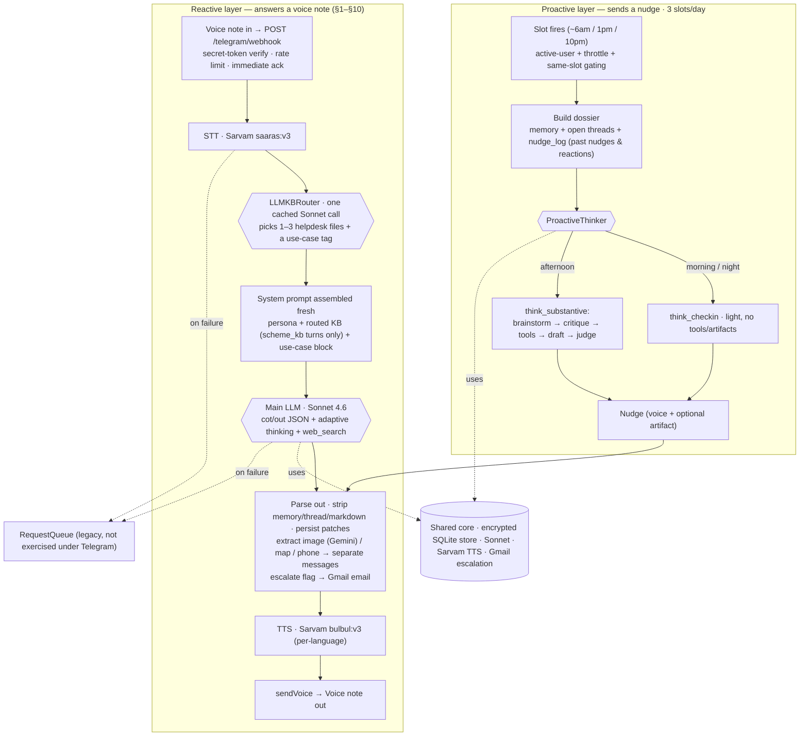

# bhAI Architecture Guide

How a Telegram voice message becomes a voice response. This document traces the full pipeline end-to-end.

For core design principles and personality, see [CLAUDE.md](CLAUDE.md).
For setup and project structure, see [README.md](README.md).

---

## Pipeline Overview

bhAI is an agent with **two layers** — a **reactive** path that answers each incoming voice note (detailed in §1–§10), and a **proactive** path that generates nudges on a schedule (the `ProactiveThinker` loop in `src/bhai/proactive/`). Both share one encrypted store, the Sonnet LLM, Sarvam TTS, the block-stripping/delivery code, and the escalation-email path.



All code paths live in `inference/webhooks/telegram_webhook.py`. The legacy `twilio_webhook.py`, `twilio_client.py`, and `security/webhook_auth.py` are dead code retained only because `resilience/worker.py` still imports `TwilioWhatsAppClient` — candidate for cleanup.

---

## 1. Webhook Entry Point

**`POST /telegram/webhook`** — `telegram_webhook.py:692`

1. **Secret-token verification**: Telegram sets the `X-Telegram-Bot-Api-Secret-Token` header on every request; we compare it against `TELEGRAM_WEBHOOK_SECRET` (constant-time). Mismatch → 403.
2. **Extract fields** from the Telegram update payload: `message.chat.id`, `message.voice.file_id` (if voice note), `message.text` (if text), `message.from.username`.
3. **User identifier**: `tg_{chat_id}` — Telegram doesn't expose phone numbers to bots. Old WhatsApp users keyed as `whatsapp:+91...` are migrated via `/admin/migrate` (see §15).
4. **Phone hash**: `_phone_hash()` — SHA256 first 12 chars, used in all logs instead of the raw identifier.
5. **Rate limit**: `_check_rate_limit()` — 10 requests per 60 seconds per user, in-memory sliding window.
6. **Message type**: Voice if `voice.file_id` present (downloaded from Telegram CDN via `getFile` → file URL). Text if `message.text` present.
7. **Dispatch**: `process_message()` added as FastAPI `BackgroundTask`. Webhook returns `{"ok": true}` immediately so Telegram doesn't retry.

---

## 2. Session Management

**`ConversationStore.get_or_create_session()`** — `src/bhai/memory/store.py:86`

- Looks up last message timestamp for this phone number
- **New session** if: no prior messages, OR gap > 4 hours (`SESSION_GAP_HOURS`)
- Session ID: random UUID (12 hex chars), stored with every message
- All timestamps in IST
- `is_first_ever_message()`: true if zero prior user messages (triggers onboarding)

---

## 3. Speech-to-Text

**`SarvamSTT.transcribe()`** — `src/bhai/stt/sarvam_stt.py`

- Model: Sarvam saaras:v3 (6.76% nWER, validated across 175 recordings — see `benchmarking/BENCHMARKING.md`)
- Audio downloaded from Telegram CDN via `TelegramClient.download_voice()` (two-step: `getFile` returns a CDN file path, then HTTP GET fetches the OGG Opus payload)
- Silence-aware chunking for audio >30 seconds
- Output: `{"text": "...", "raw": {...}}`

**On failure**: Request queued at `stage="stt"`, user gets Hindi fallback text:
> "Sun nahi paayi, thodi der mein phir try karti hoon."

---

## 4. Onboarding Flow

**First-ever message handling** — `telegram_webhook.py:451-509`

Three branches:

| Condition | Action |
|-----------|--------|
| First-ever + greeting word or `/start` | Skip FAQ + LLM entirely, send `_INTRO_TEMPLATE` directly |
| First-ever + real question | Run through LLM normally, **append** intro text after the answer |
| Returning user with prior history sends `/start` | Re-onboarding flow — see §15 |

The intro varies by TTS backend (`telegram_webhook.py:88-92`):
- **ElevenLabs (Vidhi clone)**: includes `_INTRO_VIDHI_CLAUSE` ("विधी की आवाज़ में बोलती हूँ पर विधी नहीं हूँ।")
- **Sarvam**: drops the Vidhi line — synthetic voice doesn't sound like Vidhi, so the claim would be false

Greeting detection: `_detect_greeting()` checks if message is short (<50 chars) and first word is in `_GREETING_WORDS`.

---

## 5. KB Retrieval (LLM-routed)

> **Replaces** the old FAQ short-circuit (dropped in commit `cd5c113`). Every reply now runs through the main LLM; the KB router only decides what content gets *injected* into the system prompt.

**`LLMKBRouter.route()`** — `src/bhai/llm/llm_router.py` (renamed from `haiku_router.py` in commit `9ad1f63`)

- Per user turn, **Claude Sonnet 4.6** (upgraded from Haiku 4.5 in `9ad1f63`) reads the user's transcript + recent conversation context + the topic index (`knowledge_base/helpdesk/_index.md`) and returns 1-3 relevant file stems (e.g., `["aadhaar", "scheme_pmjay"]`)
- The recent-context input is what fixed follow-up disambiguation: "what about my husband?" now correctly carries forward the scheme-eligibility context from the prior turn
- Prompt-caching via `cache_control: {type: "ephemeral"}` keeps the topic-index tokens cheap across turns
- The matched files' full contents are then loaded from `knowledge_base/helpdesk/{stem}.md` and concatenated into the system prompt under `=== Helpdesk KB ===`
- Falls back to a keyword-based `KBRouter` (`src/bhai/llm/kb_router.py`) on any Haiku failure — network, timeout, missing key, malformed response

**`knowledge_base/helpdesk/_index.md`** — always-on meta-doc listing bhAI's 13 supported helpdesk topics (documents like Aadhaar/PAN/voter ID + central + state schemes). Loaded even when the router returns zero matches, so bhAI can tell users what it *can* answer.

**Source of truth**: `Helpdesk-Information.xlsx` in the same folder is the human-editable source; the 27 `.md` files are derived from it. No runtime ingestion — conversion happens offline when the Excel changes.

**Why we dropped FAQ short-circuit**: Jaccard similarity on tokens was too rigid for Hindi/Marathi/Hinglish code-mixing, and bypassing the LLM lost personality and context awareness. The Haiku router gives content scoping without losing the main LLM's voice.

---

## 6. System Prompt Construction

This is the core of how bhAI thinks. Built by `BaseLLM._build_system_prompt()` in `src/bhai/llm/base.py:130`.

### What the LLM receives

```
System Prompt:
┌─────────────────────────────────────────────────────┐
│  Prompt Template (current.md or prompt_v1_pilot.md) │  ← persona, rules, tone
│  + === User Profile ===                             │  ← from knowledge_base/users/{phone}.md
│  + === Memory Summary ===                           │  ← rolling 3-4 line Hindi summary
│  + === Remembered Facts ===                         │  ← bullet list of key details
│  + === Helpdesk KB ===                              │  ← LLM-routed 1-3 files (see §5)
│  + === Use Case ===                                 │  ← Haiku-tagged block: see §6a
│  + === Emotion Annotation ===                       │  ← EMOTIONS_JSON format instruction
│  + === Memory Patch Instruction ===                 │  ← <memory>...</memory> protocol (§9)
└─────────────────────────────────────────────────────┘

User Message:
┌─────────────────────────────────────────────┐
│  === Recent Conversation === (last 8 msgs)  │
│  [Topic-switch suggestion if 6+ turns]      │
│  (New session flag if applicable)           │
│  "User ka voice message (Hindi/Marathi)..." │
│  User: {transcript}                         │
└─────────────────────────────────────────────┘
```

### Prompt versions

Selected via `PROMPT_VERSION` env var, loaded from `src/bhai/llm/prompts/{version}.md`.

| Version | File | Persona |
|---------|------|---------|
| `current` (default) | `current.md` | Casual friend. Extraverted, conversational. Devanagari-first. |
| `prompt_v1_pilot` | `prompt_v1_pilot.md` | Pilot prompt (Sonnet-optimized). Brother persona, anti-sycophancy, KB-strict rules, helpdesk-first mode. |

Templates are cached after first load (`BaseLLM._prompt_cache`).

### Shared knowledge (always loaded at init)

Three files from `knowledge_base/shared/` are loaded in `BaseLLM.__init__()`:

| File | Purpose |
|------|---------|
| `company_overview.md` | Tiny Miracles mission, workshops, work hours, attendance rules |
| `style_guide.md` | Tone, length targets (20-40s), structure, what to avoid |
| `escalation_policy.md` | When to set `ESCALATE: true` (health, DV, self-harm, etc.) |

### Per-user context

- **User profile**: `knowledge_base/users/{phone}.md` — Fernet-encrypted at rest, decrypted at load time. Contains name, department, family, personality notes.
- **Memory summary**: Rolling 3-4 line Hindi summary of past conversations.
- **Extracted facts**: Bullet list of remembered details (name, family, preferences).

### Topic tracking

`BaseLLM._TOPIC_KEYWORDS` (line 156) maps 7 topic categories to Hindi/English keywords:
khana, Mumbai, kaam, mausam, Bollywood, parivaar, zindagi.

If the same topic is detected for 6+ consecutive turns, a Hindi suggestion is injected into the user message prompting a smooth topic switch. Transition map in `_TOPIC_TRANSITIONS` (line 210).

### Emotion annotation

When using `generate_with_emotions()`, the system prompt includes `EMOTION_INSTRUCTION` requesting:
```
EMOTIONS_JSON: [{"text": "segment text", "emotion": "neutral"}, ...]
```
Valid emotions: `excited`, `whisper`, `sigh`, `sad`, `laugh`, `pause`, `neutral`.

Used by ElevenLabs TTS for voice modulation. Sarvam TTS ignores emotions.

### Use-case routing (commit `c3b3bb9`)

In addition to the KB files chosen by `LLMKBRouter`, the same Haiku call also emits a **use-case tag** for the turn. The tag selects a use-case-specific instruction block that gets injected into the system prompt alongside the KB content.

Valid tags (`VALID_USE_CASES`):

| Tag | When it fires | What the block teaches |
|-----|---------------|------------------------|
| `grievance` | Workplace conflict, pay, harassment, HR concerns | How to listen first, name the pattern, ESCALATE flow with consent |
| `finance` | User's own salary, PF/EPF, loans, EMIs | Anti-sycophancy on financial decisions, listen-first shape |
| `finance_advice` | Math-shaped questions (EMI, total interest, savings rate, "should I take this loan?") | Math-discipline block: do the calculation explicitly, show the burden vs income, then advise (commit `5760959`) |
| `scheme_kb` | Govt schemes / documents (Aadhaar, PAN, ESIC, etc.) | Use the KB content faithfully, defer to named contacts (Priti BC / Dinesh MIDC) for paperwork |
| `general` | Restaurants, recipes, prices, opinions, daily life | Answer like a friend would — don't punt to Google, give concrete options |

Blocks live in [src/bhai/llm/prompts/use_cases/](src/bhai/llm/prompts/use_cases/) — one file per tag. Adding a new use case = add the file + extend `VALID_USE_CASES`.

Why split into blocks: a single mega-prompt that handles every use case starts contradicting itself (the wage-grievance "listen first" rule clashes with the helpdesk "give the answer fast" rule). Per-turn injection scopes the rule set to the relevant mode.

---

## 7. LLM Backends

**`create_llm()`** — `src/bhai/llm/__init__.py`

Selected via `LLM_BACKEND` env var:

| Backend | Class | Model |
|---------|-------|-------|
| `sarvam` | `SarvamLLM` | `sarvam-105b` via OpenAI-compatible API |
| `openai` | `OpenAILLM` | `gpt-4o-mini` |
| `claude` (pilot default) | `ClaudeLLM` | Configurable via `ANTHROPIC_MODEL` env var (default: `claude-haiku-4-5-20251001`, pilot uses Sonnet) |

All inherit from `BaseLLM` and only implement `_call_api()` + `model_name`.

API calls go through `_call_api_with_retry()` — 3 attempts, exponential backoff (1s base, 10s max) via `retry_with_backoff()`.

### Response parsing

1. **Escalation**: `_detect_escalation()` looks for `ESCALATE: true/false` line
2. **Cleanup**: `_clean_response()` strips ESCALATE and EMOTIONS_JSON lines
3. **Emotions**: `_parse_emotion_segments()` extracts and validates the JSON array

**On LLM failure**: Request queued at `stage="llm"` with transcript saved. No user notification (voice-only mode — they'll get the response when retry succeeds).

---

## 8. Escalation & Anti-Lying

### Categories

Categories that trigger `ESCALATE: true` (from `escalation_policy.md`):
- Health emergencies (injury, pregnancy, sick child)
- Domestic violence or safety threats
- Self-harm or extreme distress
- Workplace harassment or bullying
- Financial crisis (eviction, medical bills)
- Legal issues
- User asks to speak with a human
- **Document/scheme help** that requires impact-team follow-up (Aadhaar, PAN, ESIC, etc. via the consent flow — see "Outreach honesty" below)

### Real-time email delivery (commits `a664eb9`, `8e8a2a8`)

When the LLM emits `ESCALATE: true` plus an `ESCALATE_CATEGORY: <value>`, the webhook calls `handle_escalation()` in [src/bhai/escalations/handler.py](src/bhai/escalations/handler.py). Flow:

```
ESCALATE: true detected in LLM response
   │
   ▼
_recipients_for_category(category, work_location)
   │ Reads work_location from the user's facts (BC / MIDC) — set by
   │ self-edited memory (§9). Falls back to user profile if absent.
   ▼
   ├─ docs_bc      → Priti (BC office)
   ├─ docs_midc    → Dinesh (MIDC office)
   ├─ docs_unknown → Priti + Dinesh
   └─ grievance    → Rishi + Anu (impact team)
   │
   ▼
EmailClient.send(to=recipients, subject, body)  ← src/bhai/integrations/email_client.py
   │ Gmail API (NOT SMTP — Railway blocks outbound SMTP)
   │ OAuth refresh-token auth via google-api-python-client
   ▼
A short voice-note acknowledgement is sent back to the user ("बात पहुँचा दी है").
```

Env vars required for the pipeline:
- `GMAIL_CLIENT_ID`, `GMAIL_CLIENT_SECRET`, `GMAIL_REFRESH_TOKEN`, `GMAIL_SENDER_EMAIL`
- `ESCALATION_RECIPIENTS` (default fallback)
- `ESCALATION_RECIPIENTS_DOCS_BC`, `ESCALATION_RECIPIENTS_DOCS_MIDC` (per-office overrides)
- `ESCALATION_CC` (always-on CC list, commit `5e8d5f6`) — recipients on every outgoing escalation regardless of category. Default use: Sundar for audit visibility.
- `ESCALATION_ENABLED` (kill switch)

If `ESCALATION_ENABLED=false` or any credential is missing, the handler logs the would-be email and returns gracefully — no user-facing failure.

### Outreach honesty rule (consent-gated escalation, commit `7f6b5fa`)

bhAI is now told explicitly that it **can** email the impact team — but only with the user's consent and only via `ESCALATE: true`. Workflow per the prompt:

1. User asks for help that requires human follow-through (e.g., Aadhaar paperwork).
2. bhAI explains what will happen and asks consent: *"मैं Priti maam को आपकी बात भेज दूँ?"*
3. On yes: bhAI emits `ESCALATE: true` + `ESCALATE_CATEGORY: docs_bc` (or whichever category) and uses future tense (*"मैं अभी भेज देती हूँ"*).
4. On no: bhAI offers self-serve KB content instead.

What bhAI may NEVER do — and the regex backstop catches if it tries:

- **Past-tense outreach claims** (*"मैंने Priti को बता दिया है"*) unless an email actually went out.
- **Fabricated attribution** (*"Vijay sir ने कहा कि..."*) when no KB content supports it.
- **Future-tense outreach without consent** (*"मैं Vijay को message करती हूँ"* without the user agreeing first).

### Regex backstop (commit `6f9e21e`)

`BaseLLM._detect_outreach_claim()` and `_guard_outreach()` (`src/bhai/llm/base.py:691-757`) scan every LLM response for confabulated outreach patterns. The contact roster `_OUTREACH_CONTACTS` covers Vijay, Priti, Rishi, Sarfaraz, Vidhi, and "impact team". The patterns:

- **Past-tense lies** (always re-prompted, no exceptions): `"मैंने <contact> को message कर दिया"`, `"<contact> ने बताया/कहा/बोला"`, `"<contact> का जवाब आया"`.
- **Future-tense without consent** (re-prompted unless `ESCALATE: true` is also in the response): `"मैं <contact> को पूछूँगी / बताऊँगी / message करूँगी"`.
- **Negation suppression**: if `नहीं` appears within ±20 chars of the match, the flag is suppressed — so honest disclaimers like *"मैं Vijay को directly message नहीं कर सकती"* pass through.

On detection, the LLM is re-prompted once with the offending sentence quoted and a correction instruction. If the second attempt also fails, the corrected text falls back to a generic safe response. The intent is **belt and suspenders** against the failure mode of past pilot incidents (May 9 Sapna karate, May 13 Jyoti Priti).

---

## 9. Memory & Summarization

### Conversation Store
**`ConversationStore`** — `src/bhai/memory/store.py`

- Backend: SQLite (`data/conversations.db`) with WAL journal mode
- Tables: `messages` (per-message, encrypted content) and `memory` (per-user rolling summary)
- All PII columns (`content_enc`, `summary_enc`, `facts_enc`) encrypted with Fernet

Every user and assistant message is saved via `save_message()`.

### Summarization (background)
**`src/bhai/memory/summarizer.py`**

- **Trigger**: Every 5 user messages (`SUMMARIZE_EVERY_N = 5`)
- **Flow**: `build_summarize_request(old_summary, recent_10_messages)` → LLM call → `parse_summary()` extracts SUMMARY and FACTS blocks → `merge_facts()` deduplicates
- **Prompt**: Hindi instruction asking for 3-4 line summary + fact list (names, family, work, health, preferences)
- **Non-critical**: Failures are logged but never block the response

### Self-edited memory (Letta-style, commit `c3b3bb9`)

In addition to the periodic background summarizer, the LLM can edit its own memory inline by emitting `<memory>` blocks alongside its user-facing response. This gives the bot agency to commit a fact the moment it learns it, rather than waiting for the next summarization tick.

Protocol (described in `MEMORY_INSTRUCTION`, surfaced in every system prompt):

```
<memory>fact: <short durable fact></memory>           → appended to facts list (deduped)
<memory>summary: <fresh 3-4 line summary></memory>    → replaces the rolling summary
```

Parsed by `BaseLLM._parse_memory_patches()` (`src/bhai/llm/base.py:575-623`) via `_MEMORY_BLOCK_RE`. The blocks are stripped from the user-facing response before TTS, then `ConversationStore.save_memory()` persists the changes. Both `summary_enc` and `facts_enc` are Fernet-encrypted at rest.

What bhAI is told to capture: name, work_location (BC/MIDC — used by escalation routing), family/health/supervisor context. What bhAI is told NEVER to capture: religion, caste, disability, loan info — these are the same blocked-from-extraction categories enforced by `scripts/extract_profiles.py`.

The background summarizer still runs every 5 user messages as a safety net in case the LLM forgot to emit a `<memory>` block.

---

## 10. TTS & Delivery

### Response cleanup (pre-TTS)

Two scrubs run on every LLM response before TTS:

1. **`BaseLLM._strip_markdown()`** (`src/bhai/llm/base.py:304-329`) — removes headings, bullet markers, numbered list prefixes, horizontal rules, asterisks, backticks, and excess blank lines so the synthesized voice doesn't read out "asterisk asterisk".

2. **`BaseLLM._strip_reasoning_leak()`** (`src/bhai/llm/base.py:452-486`) — splits on blank lines and drops any paragraph containing internal-jargon markers (`"system prompt"`, `"anti-sycophancy"`, `"TTS engine"`, `"let me think"`, `"मुझे सोच"`, etc.). Last-paragraph fallback if everything strips. Catches chain-of-thought leakage where the LLM accidentally narrates its reasoning into the user-facing reply (commit `75f9a1c`).

3. **`detect_language_code()`** (`src/bhai/tts/sarvam_tts.py:52-85`, commit `5dc11a8`) — picks the Sarvam `target_language_code` per call by counting characters in 9 Indic Unicode blocks (Devanagari→`hi-IN`, Bengali→`bn-IN`, Gurmukhi→`pa-IN`, Gujarati→`gu-IN`, Odia→`od-IN`, Tamil→`ta-IN`, Telugu→`te-IN`, Kannada→`kn-IN`, Malayalam→`ml-IN`). Falls back to `hi-IN` for empty/punctuation-only text, `en-IN` only when Latin letters are present with zero Indic chars. Before this fix, Tamil/Telugu/Bengali replies were force-fed through Sarvam's Hindi voice ("Sundar!" was read as "Sundar factorial" in the 2026-05-27 dev test).

4. **`normalize_currency_for_sarvam()`** (`src/bhai/tts/sarvam_tts.py:88-124`, commit `a5c5024`) — runs immediately before the Sarvam API call, but **only for Devanagari output** (`hi-IN` / `mr-IN`). Converts `₹500` → `500 रुपए`, `₹500-800` → `500 से 800 रुपए`, `Rs. 500` → `रुपए 500`, and `rupees`/`rupee` → `रुपए`. Other Indic scripts handle currency natively in Sarvam's voice models, so they skip this normalization.

### Text-to-Speech

Selected via `TTS_BACKEND` env var:

| Backend | Voice | Model | Flow |
|---------|-------|-------|------|
| `sarvam` (default) | `suhani` (hi-IN) | `bulbul:v3` | API → WAV → `convert_to_ogg_opus()` |
| `elevenlabs` | Vidhi's cloned voice | `eleven_multilingual_v2` | API → MP3 → OGG Opus. Supports `synthesize_with_emotions(segments)` |

`bulbul:v3` is the active Sarvam TTS model (set via `SARVAM_TTS_MODEL`). It handles numbers and abbreviations natively. The payload sent to Sarvam includes `text`, `target_language_code`, `speaker`, and `model` (`src/bhai/tts/sarvam_tts.py:68-73`).

Emotion tags from `src/bhai/tts/emotion_tagger.py` map to ElevenLabs SSML-like annotations (e.g., `excited` → `[excited]`).

### Delivery to Telegram

```python
telegram_client.send_voice(chat_id, ogg_path)
```

The bot uploads the OGG Opus file directly to Telegram via `sendVoice` multipart — **no public audio URL needed**, no `/audio/{filename}` endpoint, no `BASE_URL` requirement on the voice path. Telegram hosts the file on its own CDN and delivers it as a voice note.

**On TTS failure**: Silent degradation — no text fallback in main path (user may retry). The legacy retry worker's TTS path does fall back to text but is not exercised under the Telegram entry point (see §11).

---

## 11. Resilience: Queue & Retry Worker (legacy)

> **Status**: This subsystem was built for the Twilio entry point. It is **not exercised under the Telegram entry point** — `telegram_webhook.py` does not enqueue failed requests. The code remains because `resilience/worker.py` still imports `TwilioWhatsAppClient`, blocking deletion of the legacy Twilio modules. Candidate for cleanup once the imports are unwound.

### Request Queue
**`RequestQueue`** — `src/bhai/resilience/queue.py`

- Backend: SQLite (`data/request_queue.db`)
- Stores: phone, sender, audio_path, stage, transcript, llm_response, domain, attempt count
- Backoff: `30s * 2^attempt`, capped at 30 minutes
- Dead after: max attempts exceeded OR request age > 23 hours (Twilio's WhatsApp message window)

### Retry Worker
**`RetryWorker`** — `src/bhai/resilience/worker.py`

```
Worker Loop (every 30s):
  dequeue_ready() → pick one pending request
       │
       ├─ stage="stt"  → transcribe → update to "llm" stage
       ├─ stage="llm"  → generate → update to "tts" stage
       └─ stage="tts"  → synthesize → send via Twilio
                              (text fallback if TTS fails)
       │
  ┌────▼──────────────┐
  │ mark_completed()   │  success
  │ mark_failed()      │  failure → re-queue with backoff
  │ send APOLOGY_TEXT  │  dead → Hindi apology to user
  └────────────────────┘
```

- Apology text: "Maaf karo, abhi kuch problem ho rahi hai. Thodi der mein phir se try karo ya apne supervisor ko call karo."

---

## Error Handling Summary

| Stage | Failure Behavior | User Experience |
|-------|------------------|-----------------|
| Secret-token verify | 403 Forbidden | Nothing (spoofed request) |
| Rate limit | `{"ok": true}` returned, processing skipped | Message silently dropped |
| Media download | Text fallback | "Sun nahi paayi, phir se voice note bhejo." |
| STT | Text fallback | "Sun nahi paayi, thodi der mein phir try karti hoon." |
| LLM | Text fallback | Generic "abhi reply nahi de paayi" message |
| TTS | Text fallback | The reply is sent as a text message instead of voice |

---

## 12. Pilot Monitoring & Admin Endpoints

All require `?key=...` query parameter (compared against `DASHBOARD_SECRET` env var, default `bhai-pilot-2026`).

| Endpoint | Purpose |
|----------|---------|
| `GET /health` | Railway healthcheck — `{"status":"healthy"}` |
| `GET /dashboard` | Per-user stats: message counts, response times, failures, first/last active |
| `GET /conversations/{phone_hash}` | Full decrypted conversation transcript for a user (JSON or HTML) |
| `GET /debug/{phone_hash}` | Debug info: memory, session, recent messages |
| `GET /admin/memory/{phone_hash}` | Rolling summary + extracted facts for one user (verify what the summarizer has captured) |
| `GET /admin/phones` | Maps phone hashes to raw identifiers (admin only) |
| `POST /admin/reset/{phone_hash}` | Wipe a user's messages, memory, and nudge tracking (`store.delete_user()`). Next `/start` triggers fresh onboarding |
| `POST /admin/migrate` | Merge a Twilio-era user into a Telegram identifier — query params `from_phone`, `to_phone`. See §15 |
| `POST /admin/test-nudge/{phone_hash}` | Fire one nudge immediately for testing |
| `POST /admin/throttle-nudge/{phone_hash}?hours=N` | Per-user nudge throttle override (N>0 = once per N hours; N≤0 clears) |
| `POST /admin/send-message/{phone_hash}?text=...` | **Trust-repair**: send a literal text via Telegram with NO LLM in the path. Saved to history as assistant message so future context sees the correction. Used after bhAI confabulates (see §16) |

The read endpoints (`/dashboard`, `/conversations`, `/debug`, `/admin/memory`) are used by the `/pilot-report` Claude Code command to generate daily monitoring reports.

---

## 13. Deployment & Data Persistence

### Hosting — Railway

bhAI runs on [Railway](https://railway.app), auto-deployed from the `main` branch of the GitHub repo. No separate deploy step — pushing to `main` triggers a build.

- **Build**: Nixpacks (auto-detected from `nixpacks.toml`). Installs `ffmpeg` via apt.
- **Runtime**: Python 3.11 (pinned — 3.13 removed `audioop` which `pydub` still depends on, commit `e4a692d`)
- **Start command** (from `Procfile` and `nixpacks.toml`):
  ```
  uvicorn inference.webhooks.telegram_webhook:app --host 0.0.0.0 --port $PORT
  ```
- **Port**: Railway assigns `$PORT` at runtime
- **Project root on Railway**: `/app/` (so `ROOT_DIR` in `config.py` resolves to `/app`)

GitHub Actions (`.github/workflows/ci.yml`) is separate — it runs tests + lint, it does NOT deploy. Railway watches the repo independently.

### Runtime filesystem layout

```
/app/                                     ← project root on Railway
├── src/bhai/                             ← code, deployed with each build
├── knowledge_base/                       ← deployed with each build (git-tracked)
│   ├── shared/*.md
│   ├── hr_admin/*.md
│   ├── helpdesk/*.md
│   └── users/*.md                        ← bulk-extracted profiles (gitignored, local-dev only)
├── inference/outputs/                    ← EPHEMERAL (wiped on each deploy)
│   ├── tg_*/                             ← per-request intermediate files (STT input, TTS output OGG)
│   └── twilio_*/                         ← legacy Twilio-era artifacts
├── .bhai_temp/                           ← EPHEMERAL (STT working dir)
└── data/                                 ← RAILWAY VOLUME MOUNT POINT (/app/data)
    ├── conversations.db                  ← messages + memory + facts (encrypted)
    ├── conversations.db-wal              ← SQLite WAL log
    ├── conversations.db-shm              ← SQLite shared memory
    ├── request_queue.db                  ← failed requests awaiting retry
    ├── request_queue.db-wal
    └── request_queue.db-shm
```

### What persists across deploys

| Item | Location | Persistence |
|------|----------|-------------|
| Conversation history (encrypted) | `/app/data/conversations.db` | ✅ On volume |
| Memory summaries & facts (encrypted) | `/app/data/conversations.db` (same DB) | ✅ On volume |
| Retry queue | `/app/data/request_queue.db` | ✅ On volume |
| Knowledge base | `/app/knowledge_base/` | ✅ Deployed with code (git-tracked) |
| User profiles (intended) | `/app/data/users/*.md` | 🟡 Planned on volume (scoped to actual users) |
| User profiles (current) | `/app/knowledge_base/users/*.md` | ⚠️ Gitignored, not in production yet |
| TTS output / intermediate audio | `/app/inference/outputs/tg_*/` | ❌ Ephemeral (uploaded to Telegram, then discarded) |
| STT temp files | `/app/.bhai_temp/` | ❌ Ephemeral |

**Note on user profiles**: The intended design is that profiles live on the Railway volume at `/app/data/users/`, Fernet-encrypted, one file per user who has actually interacted with bhAI (NOT every TM employee). `scripts/extract_profiles.py` is the local-dev bulk extractor — in production, profiles are uploaded only for pilot users via an admin endpoint (planned).

**Current state (pre-migration)**: profiles only exist on developer laptops in `knowledge_base/users/` (gitignored, line 49). Production has no profiles — `load_user_profile()` returns `""` for every user. bhAI learns names/context purely from conversation history. This is safe (no data loss) but means profile-aware prompt features are a no-op until the migration lands.

### Secrets

All environment variables are set in the Railway dashboard (Variables tab), not in code. `.env.example` at the repo root lists every required key.

Critical keys:
- `BHAI_ENCRYPTION_KEY` — Fernet key for encrypting all PII at rest. **Rotating this orphans all existing encrypted data.** Back it up.
- `TELEGRAM_BOT_TOKEN`, `TELEGRAM_WEBHOOK_SECRET` — bot identity and webhook verification
- `SARVAM_API_KEY`, `ANTHROPIC_API_KEY`, `ELEVENLABS_API_KEY` — provider keys
- `DASHBOARD_SECRET` — gate for `/dashboard` and `/admin/*` endpoints (default `bhai-pilot-2026`)
- `BASE_URL` — Railway's public URL (used by Telegram `setWebhook` registration; not used for audio delivery anymore)

### Inspecting the volume

The Railway dashboard shows volume size but no built-in file browser. To see what's actually stored:

```bash
# Using Railway CLI (requires `railway link` to the project first)
railway run ls -lh /app/data

# Check disk usage breakdown
railway run du -sh /app/data/*

# Tail a SQLite DB (read-only)
railway run sqlite3 /app/data/conversations.db ".tables"
```

Alternatively, the monitoring endpoints (`/dashboard`, `/conversations/{hash}`) already expose the conversation DB contents in a privacy-safe way — that's usually what you actually want.

---

## 14. Proactive Nudges

bhAI proactively reaches out to users twice a day with a short LLM-generated message that picks up from recent conversation. This is the first feature where bhAI initiates contact — every other path is reactive.

### Schedule

| Slot | Window (IST) |
|------|--------------|
| `morning` | 10:00 – 10:30 |
| `night` | 21:00 – 21:30 |

Quiet hours: never fire between 23:00 and 08:00 IST. All times in IST regardless of server timezone (`nudges.py:35-50`).

### Loop

```
nudge_loop() (asyncio task in FastAPI lifespan, telegram_webhook.py:307-314)
   │ wakes every nudge_check_interval_seconds (default 300s)
   ▼
For each candidate user:
   ├─ Skip if user messaged in last 3h        (SKIP_IF_USER_ACTIVE_HOURS)
   ├─ Skip if same slot fired within 18h      (MIN_GAP_BETWEEN_SAME_SLOT_HOURS)
   ├─ Skip if user inactive 7+ days           (config.nudge_active_user_days)
   ├─ Skip if outside slot window or quiet hours
   ▼
generate_nudge_text(user) — LLM call with NUDGE_INSTRUCTION
   ▼
telegram_client.send_voice() (or send_text on TTS failure)
   ▼
store.record_nudge_sent(phone, slot)  → nudges table
```

### Allowlist + wildcards

`NUDGE_PHONES` env var controls who gets nudges:
- Comma-separated list of phone identifiers (`tg_12345,whatsapp:+91...`) — only those users
- `*` — wildcard, every active user gets nudges (`is_wildcard_allowlist()` at `nudges.py:141-143`)
- Empty — nudges disabled entirely

### Per-user throttle override

Beyond the global 18h same-slot gap, individual users can have a custom throttle via the `nudge_prefs` table (`memory/store.py`). Admin sets it with `POST /admin/throttle-nudge/{phone_hash}?hours=N`:
- `hours > 0` — nudge no more than once per N hours for this user
- `hours ≤ 0` — clear the override, revert to the global gap

Used in pilot when a user explicitly said "stop messaging me so much" or showed signs of nudge fatigue.

### Storage

Two tables in `conversations.db`:
- `nudges` — `(phone, slot, last_sent)`, composite PK
- `nudge_prefs` — `(phone, throttle_hours, updated_at)`, per-user override

Methods on `ConversationStore`: `record_nudge_sent()`, `get_last_nudge_sent()`, `set_throttle_hours()`, `get_throttle_hours()`.

### Why LLM-generated, not templated

Templated nudges ("Hi! How are you?") feel like spam. The `NUDGE_INSTRUCTION` prompt asks the LLM to pick up a specific thread from recent history (a person mentioned, a worry, a plan) — so each nudge feels like a friend remembering something specific. Source: `nudges.py:210-231`.

### Manual testing

`POST /admin/test-nudge/{phone_hash}?key=...` fires one nudge immediately, bypassing all skip rules. Useful for verifying voice quality and prompt behavior without waiting for the schedule window.

---

## 15. Re-onboarding for Migrated Users

When the project moved from Twilio/WhatsApp to Telegram, existing pilot users had to be migrated — their conversation history and memory needed to follow them to the new identifier.

### Migration

**`POST /admin/migrate?key=...&from_phone=...&to_phone=...`** (`telegram_webhook.py:1078-1117`)

Calls `store.merge_user(from_phone, to_phone)` (`memory/store.py:260-292`), which in one transaction:

1. Re-keys all rows in the `messages` table from `from_phone` to `to_phone`
2. Merges `memory` row (deleting any pre-existing target row to avoid PK conflict)
3. Merges `nudges` rows (same conflict handling)

After migration, the user's full history is now keyed under their Telegram identifier (`tg_{chat_id}`).

### Re-onboarding trigger

When a migrated user sends `/start` on Telegram for the first time (`telegram_webhook.py:451-509`):

- `is_first_ever_message()` returns False (history exists)
- Greeting word is `/start`
- → `is_re_onboarding = True`

The webhook then:
1. Skips FAQ cache
2. Injects `RE_ONBOARDING_INSTRUCTION` (`telegram_webhook.py:98-112`) into the system prompt
3. Passes `is_new_session=True` so memory + recent history are loaded fresh

The instruction tells the LLM to (a) acknowledge recognition with one warm line, (b) reference one concrete detail from memory (a person, worry, plan, topic), and (c) ask one warm follow-up rooted in that detail. This makes the migration feel like reconnecting with someone who remembers, not starting over.

---

## 16. Outreach Honesty + Trust Repair

bhAI is an AI. It cannot actually message Vijay, Priti, Sarfaraz, or anyone else on the impact team. Anything bhAI says about an outreach is a representation of what WILL happen (via the human pilot team), not what HAS happened. Without explicit guardrails, the LLM tends to fabricate "I already asked Vijay" / "Priti said yes" style claims when users probe about a prior promise. This destroys trust the moment a user follows up and discovers there was no actual exchange.

### The hard prompt rule

In [src/bhai/llm/prompts/prompt_v1_pilot.md](src/bhai/llm/prompts/prompt_v1_pilot.md) lines 102-123, the **Honesty-About-Outreach Rule** explicitly bans:

- Past-tense outreach claims (`मैंने पूछ लिया है`, `Vijay का जवाब आया`) unless the action genuinely happened
- Fabricated details attributed to a named impact-team contact
- Scope creep beyond document help and KB schemes for Vijay/Priti specifically

Only future tense is allowed: `मैं पूछ के बताऊँगी` ("I'll go ask and let you know").

### Trust-repair endpoint

When a confabulation does slip through (it has, multiple times in pilot — Sapna May 9, Jyoti May 13), Sundar can issue a literal correction via:

**`POST /admin/send-message/{phone_hash}?text=...&key=...`** (`telegram_webhook.py:1280-1320`)

Behavior:
- Sends `text` verbatim to the user via Telegram `sendMessage` (text, not voice)
- **NO LLM in the path** — the message text comes straight from the operator
- Saved into `messages` table as an assistant message with the correction body
- Future LLM turns see the correction in conversation history and can reference it accurately

Typical use: "Sorry, I made a mistake — I haven't actually messaged Priti yet. Let me do that and get back to you."

This is part of the broader pattern: detecting bad LLM behavior in `/pilot-report`, reading the transcript, deciding what to say, and committing it to history without trusting the same LLM that produced the original error to also produce the correction.

---

## Related Docs

- [CLAUDE.md](CLAUDE.md) — Core principles, personality, component reference
- [README.md](README.md) — Setup, configuration, project structure
- [CONTRIBUTING.md](CONTRIBUTING.md) — Development workflow, code structure
- [knowledge_base/README.md](knowledge_base/README.md) — Editing guidelines for Tiny team
- [benchmarking/BENCHMARKING.md](benchmarking/BENCHMARKING.md) — STT model evaluation
