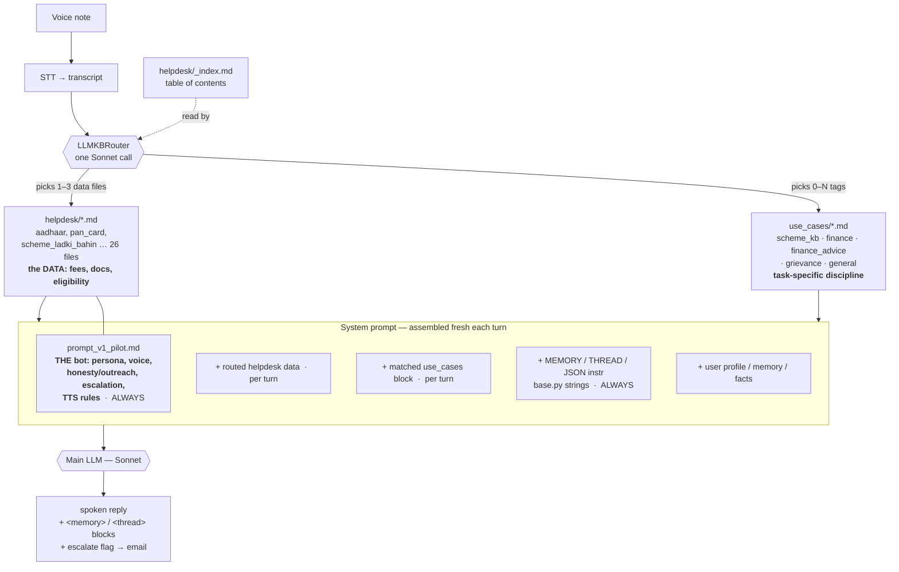
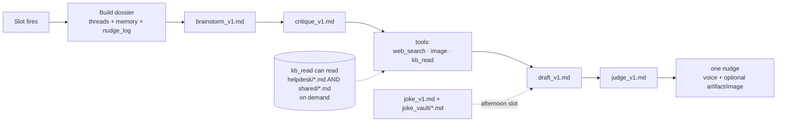

# bhAI v2 — the .md files that shape the bot, and when each is consulted

Two surfaces: **reactive** (answers a voice note) and **proactive** (sends a nudge).
Each pulls a different set of files. The key idea is *context engineering*: only
the relevant files load per turn — never everything.

## Reactive path (per voice note)

## Proactive path (per slot — morning / afternoon / night)

## Every .md file, by role

| File(s) | Role | When loaded |
|---|---|---|
| **`prompt_v1_pilot.md`** | THE bot — persona, voice, honesty/outreach + escalation rules, TTS formatting | **Every reactive turn** |
| **`use_cases/scheme_kb.md`** | KB-discipline for docs/schemes (authoritative, completeness, web_search ladder, no fabrication) | When router tags `scheme_kb` |
| **`use_cases/finance_advice.md`** | The 4-check math discipline for loan/EMI/investment decisions | When router tags `finance_advice` |
| **`use_cases/finance.md`** | Salary/PF/loan-balance — "data not wired yet, don't invent numbers" | When router tags `finance` |
| **`use_cases/grievance.md`** | Listen-first handling of workplace/personal problems; defers routing to the escalation rules | When router tags `grievance` |
| **`use_cases/general.md`** | Everyday Google-style questions — answer from general knowledge, hedge, don't deflect | When router tags `general` |
| **`helpdesk/*.md`** (26) | The DATA — per-scheme/per-doc fees, documents, eligibility, centre addresses, contacts | The relevant 1–3, per turn |
| **`helpdesk/_index.md`** | Table-of-contents the router scans to choose helpdesk files | Every turn (by the router) |
| **`proactive/prompts/{brainstorm,critique,draft,judge,joke}_v1.md`** | The 5 stages of the nudge generator | Proactive slots |
| **`proactive/prompts/joke_vault/{jokes_v1_hi,jokes_v1_en}.md`** | Vetted joke library for the afternoon joke nudge | Proactive joke stage |
| **`shared/{company_overview,escalation_policy,style_guide}.md`** | NOT in the reactive prompt (that content is inline in the template). Only reachable on demand by the proactive `kb_read` tool | On demand (proactive only) |
| **`MEMORY_INSTRUCTION` / `THREAD_INSTRUCTION` / `_JSON_OUTPUT_INSTRUCTION`** | (Python strings in `base.py`, not .md) Tell the model to emit `<memory>`/`<thread>` blocks + the JSON output contract | Every reactive turn |
| ~~`current.md`~~ | Old alternate prompt version — **deleted** (default repointed to `prompt_v1_pilot`) | — |
| `prompts/CHANGELOG.md` | Human changelog — never loaded by the bot | — |

## One-line takeaways
- **`prompt_v1_pilot.md` is the bot.** Everything else is conditional context layered on top.
- **The router is the context engineer** — it decides which data + which discipline block each turn needs, so the prompt stays small and fast.
- **`scheme_kb.md` is now pure principles**; the specific scheme/doc data flows in from `helpdesk/*.md`, not duplicated in the rules.
- **`shared/*.md` no longer touches the reactive bot** — keep editing behavior in `prompt_v1_pilot.md`, not those files.
